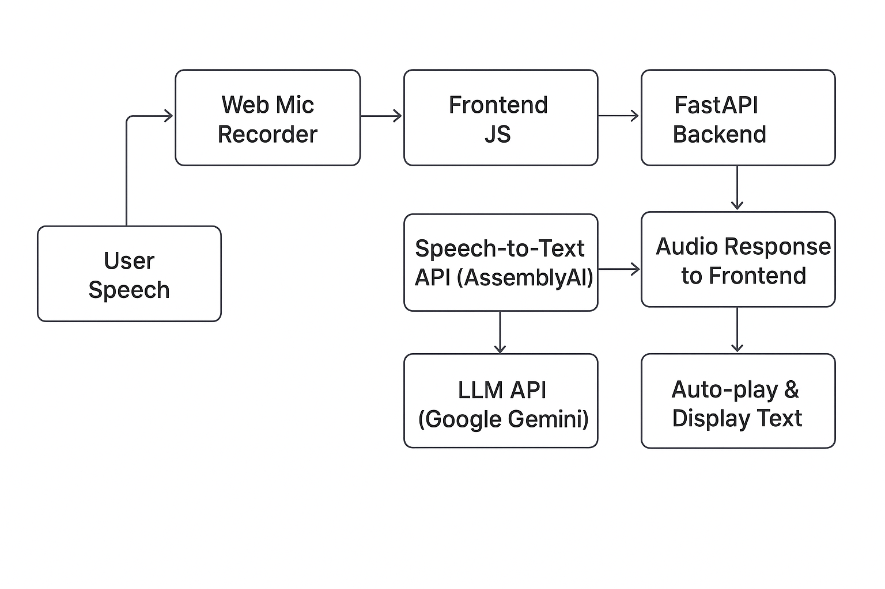

# 🎤 AI Voice Assistant — 30 Days of AI Voice Agents (Day 1–12)

An end-to-end **AI Voice Assistant** built as part of the **#30DaysOfAIVoiceAgents** challenge.  
This project combines **speech recognition, large language models, and text-to-speech** to create a fully interactive conversational agent.

---

## 📌 Project Overview

The AI Voice Assistant:
- Listens to the user through a microphone.
- Converts speech to text using **Speech-to-Text (STT)** APIs.
- Sends the transcription to an **LLM** for generating intelligent responses.
- Converts the LLM’s response into speech using **Text-to-Speech (TTS)**.
- Plays the audio back to the user in real-time.
- Features a **revamped UI** (Day 12) for a modern, clean, and interactive experience.

---

## 🛠️ Technologies Used

**Frontend**
- HTML5, CSS3, JavaScript
- MediaRecorder API for audio capture
- Fetch API for server communication

**Backend**
- Python 3.10+
- FastAPI for API endpoints
- `uvicorn` as the ASGI server

**APIs**
- **Speech-to-Text (STT):** AssemblyAI
- **Large Language Model (LLM):** Google Gemini
- **Text-to-Speech (TTS):** Murf AI

**Other**
- Fallback audio mechanism for error handling
- Environment variable configuration for API keys

---

## 🏗️ Architecture

## ✨ Key Features

- **🎤 Voice Recording & Processing** – Record user audio directly from the browser and send it to the backend for processing.
- **🗣️ Speech-to-Text (STT)** – Convert spoken input to text using AssemblyAI API.
- **💬 Conversational AI** – Process user queries with Google Gemini LLM for intelligent responses.
- **🔊 Text-to-Speech (TTS)** – Generate natural-sounding audio replies with Murf AI.
- **⚡ Real-time Interaction** – Fast request/response cycle for a smooth conversational experience.
- **🛡️ Robust Error Handling** – Gracefully handle STT, LLM, and TTS failures with fallback audio messages.
- **🎨 Modern UI Design** – Clean, responsive, and interactive frontend with a prominent record button.
- **🔄 Single Record/Stop Button** – Simplified recording control with dynamic state changes.
- **🎬 Auto Audio Playback** – Automatically plays AI-generated responses without manual play clicks.
- **📂 Modular Day-wise Code** – Each day’s folder contains its own `index.html`, backend script, and dependencies for easy tracking.\
  
## How to Run

1️⃣ Clone the repository
git clone https://github.com/<your-username>/<your-repo>.git
cd <your-repo>

2️⃣ Install dependencies
pip install -r requirements.txt

3️⃣ Set environment variables
Create a .env file in the project root:

ASSEMBLYAI_API_KEY=your_assemblyai_key
GEMINI_API_KEY=your_gemini_key
MURFAI_API_KEY=your_murfai_key

4️⃣ Run the backend
uvicorn main:app --reload
(or python app.py if using Flask)

5️⃣ Open the frontend
Open index.html in your browser

Allow microphone access

Click the 🎤 Start Recording button and talk to your assistant

## 📦 Folder Structure

│── Day 1/
│ │── index.html # Frontend UI for Day 1
│ │── main.py / app.py # FastAPI or Flask backend for Day 1
│ │── requirements.txt # Python dependencies for Day 1
│

│── Day 2/
│ │── index.html
│ │── main.py / app.py
│ │── requirements.txt
│

│── ...
│

│── Day 12/
│ │── index.html
│ │── main.py / app.py
│ │── requirements.txt
│

│── images/ # Project screenshots & architecture diagrams
│ │── Architecture.png
│

│── README.md # Project documentation

📬 Connect

If you’re building AI voice agents or working on conversational AI, I’d love to connect!
📧 Email: sushantmore1503@example.com
🔗 LinkedIn: www.linkedin.com/in/sushantmore15

#AI #VoiceTech #ConversationalAI #FastAPI #AssemblyAI #GoogleGemini #MurfAI #SpeechToText #TextToSpeech #MachineLearning #Python #VoiceAgents #30DaysOfAIVoiceAgents
